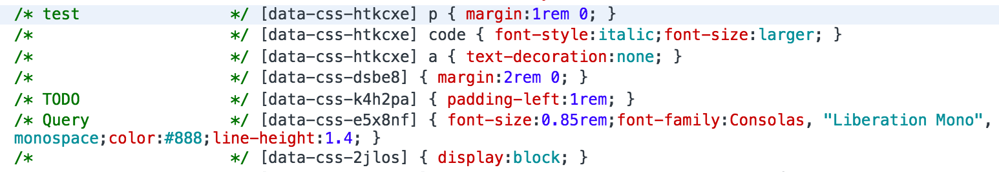

<big><h1 align="center">glamor-plugin-extract-to-comment</h1></big>

<p align="center">
  <a href="https://npmjs.org/package/glamor-plugin-extract-to-comment">
    
  </a>

  <a href="https://coveralls.io/r/vdanchenkov/glamor-plugin-extract-to-comment">
    
  </a>

  <a href="https://travis-ci.org/vdanchenkov/glamor-plugin-extract-to-comment">
    
  </a>

  <a href="https://npmjs.org/package/glamor-plugin-extract-to-comment">
    
  </a>

  <a href="https://david-dm.org/vdanchenkov/glamor-plugin-extract-to-comment.svg">
    
  </a>

  <a href="https://github.com/vdanchenkov/glamor-plugin-extract-to-comment/blob/master/LICENSE">
    
  </a>
</p>

<big>
Glamor plugin that extracts specified css property to comment for better readability.
</big>

## Install

```sh
npm install -S glamor-plugin-extract-to-comment
```

## Usage

```js
import extractToComment from "glamor-plugin-extract-to-comment"

import { plugins } from 'glamor'
// to show labels as comments and remove them from rules
plugins.add(extractToComment('label', true))
// or simply
plugins.add(extractToComment())
```
<p align="center">
  
</p>

## License

MIT © [Vladimir Danchenkov](http://github.com/vdanchenkov)

[npm-url]: https://npmjs.org/package/glamor-plugin-extract-to-comment
[npm-image]: https://img.shields.io/npm/v/glamor-plugin-extract-to-comment.svg?style=flat-square

[travis-url]: https://travis-ci.org/vdanchenkov/glamor-plugin-extract-to-comment
[travis-image]: https://img.shields.io/travis/vdanchenkov/glamor-plugin-extract-to-comment.svg?style=flat-square

[coveralls-url]: https://coveralls.io/r/vdanchenkov/glamor-plugin-extract-to-comment
[coveralls-image]: https://img.shields.io/coveralls/danchenkov/glamor-plugin-extract-to-comment.svg?style=flat-square

[depstat-url]: https://david-dm.org/vdanchenkov/glamor-plugin-extract-to-comment
[depstat-image]: https://david-dm.org/vdanchenkov/glamor-plugin-extract-to-comment.svg?style=flat-square

[download-badge]: http://img.shields.io/npm/dm/glamor-plugin-extract-to-comment.svg?style=flat-square
